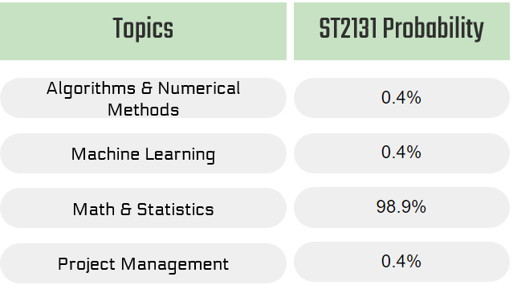

# Backend

This is the directory where all backend model code and scripts are stored.

## Setting up the Environment

The only programming language used is **Python**. The code was created and tested using Python version 3.9 and after.

The necessary libraries are listed in `requirements.txt` in the root directory. Install them via the command line with `pip install -r requirements.txt`.

In addition to theses libraries, the model requires some additional resourses. From the backend directory in command terminal, run the following to download them.

```
python -c "import nltk; nltk.download('punkt'); nltk.download('stopwords'); nltk.download('wordnet'); nltk.download('omw-1.4')"
git lfs install
git clone https://huggingface.co/bert-base-uncased
```


## Files and Directories

After downloading the additional resourses, the backend directory should look like the following.

```
backend
│   launch.py
│   lda.py
│   README.md
│   similarity_measures.py
│
├───bert-base-uncased
├───data
│   └───majors_info
├───Questions
├───Scripts
```

- `launch.py` contains the main Flask app that boots up the API to access data and model outputs. 
- `lda.py` is the code for LDA model, used to perform topic modelling and generate topic distribution given any piece of text.
- `similarity_measure.py` is the code for BERT model, used to perform similarity comparisons between course/job descriptions.
- `bert-base-uncased` is the model cloned using `git clone` command previously.
- `data` stores the raw datasets. It's the output folder for webscraping scripts and input folder for models.
- `Questions` contains the question bank used for the quiz feature.
- `Scripts` contains helper scripts not automatically run by the main programs. These include course and job description scraping scripts, as well as code used for model testing and evaluation in `.ipynb` files. 

## Running the Backend

From the backend directory in command terminal, run

```
flask --app launch --debug run
```

Then visit `localhost:5000/endpoint_path` with appropriate parameters in your web browser to obtain or test the endpoints. You may find some sample links in `launch.py`.

User may also interact individual models by adding code under `if __name__ == "__main__":` in `lda.py` and `similarity_measure.py`. 


## Models Used

### Topic Modelling via Latent Dirichlet Allocation (LDA)

[LDA](https://en.wikipedia.org/wiki/Latent_Dirichlet_allocation) is an unsupervised algorithm that allows us to identify prominent concepts present in Data Science courses and group them into topics. The key advantage of this statistical method is that we can quantify the extent of every topic given a piece of text based on probability calculations. 

This aims to provide students with overview of the topics involved in Data Science and the extent of these topics in various curriculums. An example is as follows.



### Similarity Measures using BERT model

[BERT](https://en.wikipedia.org/wiki/BERT_(language_model)) is a family of language model that can perform embedding of text into numeric vectors. The process is able to capture meaning of words, e.g. vector for "calculus" would be close to the vector for "integration" and far from "software". 

This enables us to identify similarity and differences among Data Science curriculums and courses. 

This aims to serve as the basis of analysis for university administrators.

We used the pre-trained  [Hugging Face base BERT model](https://huggingface.co/docs/transformers/model_doc/bert).

